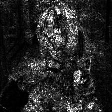
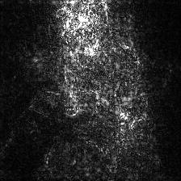
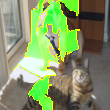
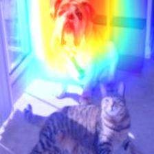
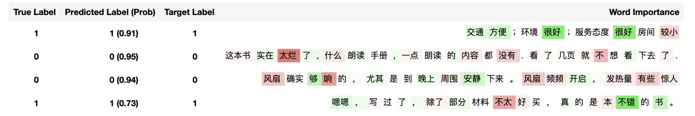

[**中文**](./README_CN.md)


# InterpretDL: Interpretation of Deep Learning Models based on PaddlePaddle

InterpretDL, short for *interpretations of deep learning models*, is a model interpretation toolkit for [PaddlePaddle](https://github.com/PaddlePaddle/Paddle) models. This toolkit contains inplementations of many interpratation algorithms, including LIME, Grad-CAM, Integrated Gradients and more. Some SOTA and new interpretation algorithms are also implemented.

*InterpretDL is under active construction and all contributions are welcome!*

# Why InterpretDL

The increasingly complicated deep learning models make it impossible for people to understand their internal workings. Interpretability of black-box models has become the research focus of many talented researchers. InterpretDL provides a collection of both classical and new algorithms for interpreting models.

By utilizing these helpful methods, people can better understand why models work and why they don't, thus contributing to the model development process.

For researchers working on designing new interpretation algorithms, InterpretDL gives an easy access to existing methods that they can compare their work with.

# Demo

Interpretation algorithms give a hint of why a black-box model makes its decision.

The following table gives visualizations of several interpretation algorithms applied to the original image to tell us why the model predicts "bull_mastiff."
Original Image | Integrated Gradients ([demo](https://github.com/PaddlePaddle/InterpretDL/blob/master/tutorials/int_grad_tutorial_cv.ipynb)) | SmoothGrad ([demo](https://github.com/PaddlePaddle/InterpretDL/blob/master/tutorials/smooth_grad_tutorial_cv.ipynb)) | LIME ([demo](https://github.com/PaddlePaddle/InterpretDL/blob/master/tutorials/lime_tutorial_cv.ipynb)) | Grad-CAM ([demo](https://github.com/PaddlePaddle/InterpretDL/blob/master/tutorials/grad_cam_tutorial_cv.ipynb))
:--------------:|:-----------:|:-----------:|:-----------:|:-----------:
||||

For sentiment classfication task, the reason why a model gives positive/negative predictions can be visualized as follows. A quick demo can be found [here](https://github.com/PaddlePaddle/InterpretDL/blob/master/tutorials/int_grad_tutorial_nlp.ipynb).




# Contents

* [Why InterpretDL](#Why-InterpretDL)
* [Demo](#demo)
* [Installation](#Installation)
    * [Pip installation](#pip-installation)
    * [Developer installation](#developer-installation)
* [Documentation](#Documentation)
* [Usage Guideline](#Usage-Guideline)
* [Contribution](#Contribution)
* [Roadmap](#Roadmap)
    * [Algorithms](#Algorithms)
    * [Tutorials](#Tutorials)
* [Copyright and License](#Copyright-and-License)

# Installation

It requires the deep learning framework [paddlepaddle](https://www.paddlepaddle.org.cn/install/quick), versions with CUDA support are recommended.

## Pip installation

```bash
pip install interpretdl

# or with baidu mirror
pip install interpretdl -i https://mirror.baidu.com/pypi/simple
```

## Developer installation

```bash
git clone https://github.com/PaddlePaddle/InterpretDL.git
# ... fix bugs or add new features
python setup.py install
# welcome to propose pull request and contribute
```


# Documentation

Online link: [interpretdl.readthedocs.io](https://interpretdl.readthedocs.io/en/latest/interpretdl.html).

Or generate the docs locally:

```bash
git clone https://github.com/PaddlePaddle/InterpretDL.git
cd docs
make html
open _build/html/index.html
```


# Usage Guideline

All interpreters inherit the abstract class [`Interpreter`](https://github.com/PaddlePaddle/InterpretDL/blob/4f7444160981e99478c26e2a52f8e40bd06bf644/interpretdl/interpreter/abc_interpreter.py), of which `interpret(**kwargs)` is the function to call.

```python
# an example of SmoothGradient Interpreter.

import interpretdl as it

def paddle_model(data):
    class_num = 1000
    model = ResNet50()
    logits = model.net(input=data, class_dim=class_num)
    probs = fluid.layers.softmax(logits, axis=-1)
    return probs

img_path = 'assets/deer.png'
sg = it.SmoothGradInterpreter(paddle_model, "assets/ResNet50_pretrained")
gradients = sg.interpret(img_path, visual=True, save_path='sg_test.jpg')
```

Details of the usage can be found under [tutorials](https://github.com/PaddlePaddle/InterpretDL/tree/master/tutorials) folder.

# Roadmap

We are planning to create a useful toolkit for offering the model interpretation.

## Algorithms

We are planning to implement the algorithms below (categorized by the explaining target):

### Input Features
- [x] SmoothGrad
- [x] IntegratedGradients
- [x] Occlusion
- [x] GradientSHAP
- [x] LIME
- [x] FastNormLIME
- [x] NormLIME
- [x] LIMEPrior
- [ ] DeepLIFT
- [ ] More ...

### Intermediate Features
- [x] GradCAM
- [x] ScoreCAM
- [ ] More ...

### Training Dataset
- [x] ForgettingEvent
- [x] SGDNoise
- [x] TrainIng Data analYzer (TIDY)
- [ ] InfluenceFunction
- [ ] More ...

## Tutorials

We plan to provide at least one example for each interpretation algorithm, and hopefully cover applications for both CV and NLP.

Current tutorials can be accessed under [tutorials](https://github.com/PaddlePaddle/InterpretDL/tree/master/tutorials) folder.

## References of Algorithms

* `IntegratedGraients`: [Axiomatic Attribution for Deep Networks, Mukund Sundararajan et al. 2017](https://arxiv.org/abs/1703.01365)
* `GradCAM`: [Grad-CAM: Visual Explanations from Deep Networks via Gradient-based Localization, Ramprasaath R. Selvaraju et al. 2017](https://arxiv.org/abs/1610.02391.pdf)
* `SmoothGrad`: [SmoothGrad: removing noise by adding noise, Daniel Smilkov et al. 2017](https://arxiv.org/abs/1706.03825)
* `GradientShap`: [A Unified Approach to Interpreting Model Predictions, Scott M. Lundberg et al. 2017](http://papers.nips.cc/paper/7062-a-unified-approach-to-interpreting-model-predictions)
* `Occlusion`: [Visualizing and Understanding Convolutional Networks, Matthew D Zeiler and Rob Fergus 2013](https://arxiv.org/abs/1311.2901)
* `Lime`: ["Why Should I Trust You?": Explaining the Predictions of Any Classifier, Marco Tulio Ribeiro et al. 2016](https://arxiv.org/abs/1602.04938)
* `NormLime`: [NormLime: A New Feature Importance Metric for Explaining Deep Neural Networks, Isaac Ahern et al. 2019](https://arxiv.org/abs/1909.04200)
* `ScoreCAM`: [Score-CAM: Score-Weighted Visual Explanations for Convolutional Neural Networks, Haofan Wang et al. 2020](https://arxiv.org/abs/1910.01279)
* `ForgettingEvents`: [An Empirical Study of Example Forgetting during Deep Neural Network Learning, Mariya Toneva et al. 2019](http://arxiv.org/abs/1812.05159)

# Copyright and License

InterpretDL is provided under the [Apache-2.0 license](https://github.com/PaddlePaddle/InterpretDL/blob/master/LICENSE).
