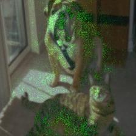
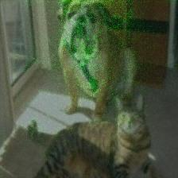
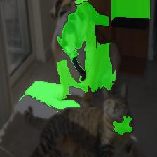
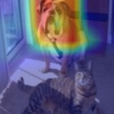
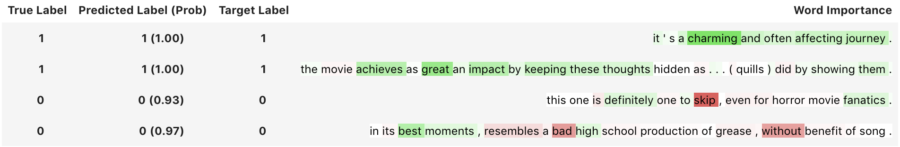

[**中文**](./README_CN.md) | English

[](https://github.com/PaddlePaddle/InterpretDL/releases)
[](https://pypi.org/project/interpretdl)
[](https://circleci.com/gh/PaddlePaddle/InterpretDL)
[](https://interpretdl.readthedocs.io/en/latest/index.html)
[](https://pepy.tech/project/interpretdl)


# InterpretDL: Interpretation of Deep Learning Models based on PaddlePaddle

InterpretDL, short for *interpretations of deep learning models*, is a model interpretation toolkit for [PaddlePaddle](https://github.com/PaddlePaddle/Paddle) models. This toolkit contains implementations of many interpretation algorithms, including LIME, Grad-CAM, Integrated Gradients and more. Some SOTA and new interpretation algorithms are also implemented.

*InterpretDL is under active construction and all contributions are welcome!*


# Why InterpretDL

The increasingly complicated deep learning models make it impossible for people to understand their internal workings. Interpretability of black-box models has become the research focus of many talented researchers. InterpretDL provides a collection of both classical and new algorithms for interpreting models.

By utilizing these helpful methods, people can better understand why models work and why they don't, thus contributing to the model development process.

For researchers working on designing new interpretation algorithms, InterpretDL gives an easy access to existing methods that they can compare their work with.

# :fire: :fire: :fire: News :fire: :fire: :fire:


- (2022/01/06) Implmented the Cross-Model Consensus Explanation method. In brief, this method averages the explanation results from several models. Instead of interpreting individual models, this method is able to identify the discriminative features in the input data with accurate localization. See the [paper](https://arxiv.org/abs/2109.00707) for details.

  * `Consensus`: Xuhong Li, Haoyi Xiong, Siyu Huang, Shilei Ji, Dejing Dou. Cross-Model Consensus of Explanations and Beyond for Image Classification Models: An Empirical Study. arXiv:2109.00707.

We show a demo with four models, while more models (around 15) could give a much better result. See the [tutorial](https://github.com/PaddlePaddle/InterpretDL/blob/master/tutorials/consensus_tutorial_cv.ipynb) for details.


- (2021/10/20) Implemented the Transition Attention Maps (TAM) explanation method for PaddlePaddle [Vision Transformers](https://github.com/PaddlePaddle/PaddleClas/blob/release/2.3/ppcls/arch/backbone/model_zoo/vision_transformer.py). As always, several lines call this interpreter. See details from the [tutorial notebook](https://github.com/PaddlePaddle/InterpretDL/blob/master/tutorials/ViT_explanations_tam.ipynb), and the [paper](https://openreview.net/forum?id=TT-cf6QSDaQ):

  * `TAM`: Tingyi Yuan, Xuhong Li, Haoyi Xiong, Hui Cao, Dejing Dou. Explaining Information Flow Inside Vision Transformers Using Markov Chain. In *Neurips 2021 XAI4Debugging Workshop*. 

| image | elephant | zebra |
:-----------:|:-----------:|:-----------:
 |  | 


# Demo

Interpretation algorithms give a hint of why a black-box model makes its decision.

The following table gives visualizations of several interpretation algorithms applied to the original image to tell us why the model predicts "bull_mastiff."
| Original Image | IntGrad ([demo](https://github.com/PaddlePaddle/InterpretDL/blob/master/tutorials/int_grad_tutorial_cv.ipynb)) | SG ([demo](https://github.com/PaddlePaddle/InterpretDL/blob/master/tutorials/smooth_grad_tutorial_cv.ipynb)) | LIME ([demo](https://github.com/PaddlePaddle/InterpretDL/blob/master/tutorials/lime_tutorial_cv.ipynb)) | Grad-CAM ([demo](https://github.com/PaddlePaddle/InterpretDL/blob/master/tutorials/grad_cam_tutorial_cv.ipynb)) |
:-----------:|:-----------:|:-----------:|:-----------:|:-----------:
||||

For sentiment classfication task, the reason why a model gives positive/negative predictions can be visualized as follows. A quick demo can be found [here](https://github.com/PaddlePaddle/InterpretDL/blob/master/tutorials/ernie-2.0-en-sst-2-tutorials.ipynb). Samples in Chinese are also available [here](https://github.com/PaddlePaddle/InterpretDL/blob/master/tutorials/ernie-1.0-zh-chnsenticorp-tutorials.ipynb).




# Contents

- [InterpretDL: Interpretation of Deep Learning Models based on PaddlePaddle](#interpretdl-interpretation-of-deep-learning-models-based-on-paddlepaddle)
- [Why InterpretDL](#why-interpretdl)
- [:fire: :fire: :fire: News :fire: :fire: :fire:](#fire-fire-fire-news-fire-fire-fire)
- [Demo](#demo)
- [Contents](#contents)
- [Installation](#installation)
  - [Pip installation](#pip-installation)
  - [Developer installation](#developer-installation)
- [Documentation](#documentation)
- [Usage Guideline](#usage-guideline)
- [Roadmap](#roadmap)
  - [Algorithms](#algorithms)
    - [Feature-level Interpretation Algorithms](#feature-level-interpretation-algorithms)
    - [Dataset-level Interpretation Algorithms](#dataset-level-interpretation-algorithms)
  - [Tutorials](#tutorials)
  - [References of Algorithms](#references-of-algorithms)
- [Copyright and License](#copyright-and-license)
- [Recent News](#recent-news)

# Installation

It requires the deep learning framework [paddlepaddle](https://www.paddlepaddle.org.cn/install/quick), versions with CUDA support are recommended.

## Pip installation

```bash
pip install interpretdl

# or with tsinghua mirror
pip install interpretdl -i https://pypi.tuna.tsinghua.edu.cn/simple
```

## Developer installation

```bash
git clone https://github.com/PaddlePaddle/InterpretDL.git
# ... fix bugs or add new features
cd InterpretDL && pip install -e .
# welcome to propose pull request and contribute
```

### Unit Tests

```bash
# run gradcam unit tests
python -m unittest -v tests.interpreter.test_gradcam
# run all unit tests
python -m unittest -v
```

# Documentation

Online link: [interpretdl.readthedocs.io](https://interpretdl.readthedocs.io/en/latest/interpretdl.html).

Or generate the docs locally:

```bash
git clone https://github.com/PaddlePaddle/InterpretDL.git
cd docs
make html
open _build/html/index.html
```

# Usage Guideline

All interpreters inherit the abstract class [`Interpreter`](https://github.com/PaddlePaddle/InterpretDL/blob/4f7444160981e99478c26e2a52f8e40bd06bf644/interpretdl/interpreter/abc_interpreter.py), of which `interpret(**kwargs)` is the function to call.

```python
# an example of SmoothGradient Interpreter.

import interpretdl as it
from paddle.vision.models import resnet50
paddle_model = resnet50(pretrained=True)
sg = it.SmoothGradInterpreter(paddle_model, use_cuda=True)
gradients = sg.interpret("test.jpg", visual=True, save_path=None)
```

Details of the usage can be found under [tutorials](https://github.com/PaddlePaddle/InterpretDL/tree/master/tutorials) folder.

# Roadmap

We are planning to create a useful toolkit for offering the model interpretations as well as evaluations.
We have now implemented the interpretation algorithms as follows, and we are planning to add more algorithms that are desired.
Welcome to contribute or just tell us which algorithms are desired.

## Implemented Algorithms

* Target at Input Features
    - [x] SmoothGrad
    - [x] IntegratedGradients
    - [x] Occlusion
    - [x] GradientSHAP
    - [x] LIME
    - [x] GLIME (LIMEPrior)
    - [x] NormLIME/FastNormLIME
    - [x] LRP

* Target at Intermediate Features
    - [x] CAM
    - [x] GradCAM
    - [x] ScoreCAM
    - [x] Rollout
    - [X] TAM

* Dataset-level Interpretation Algorithms
    - [x] Forgetting Event
    - [x] SGDNoise
    - [x] TrainIng Data analYzer (TIDY)

* Cross-Model Explanation
    - [x] Consensus

## Planning Alorithms

* Dataset-level Interpretation Algorithms
    - [ ] Influence Function

* Evaluations
    - [x] Perturbation Tests
    - [x] Deletion & Insertion
    - [x] Localization Ablity
    - [ ] Local Fidelity
    - [ ] Sensitivity

## Tutorials

We plan to provide at least one example for each interpretation algorithm, and hopefully cover applications for both CV and NLP.

Current tutorials can be accessed under [tutorials](https://github.com/PaddlePaddle/InterpretDL/tree/master/tutorials) folder.

# References of Algorithms

* `SGDNoise`: [On the Noisy Gradient Descent that Generalizes as SGD, Wu et al 2019](https://arxiv.org/abs/1906.07405)
* `IntegratedGraients`: [Axiomatic Attribution for Deep Networks, Mukund Sundararajan et al. 2017](https://arxiv.org/abs/1703.01365)
* `CAM`, `GradCAM`: [Grad-CAM: Visual Explanations from Deep Networks via Gradient-based Localization, Ramprasaath R. Selvaraju et al. 2017](https://arxiv.org/abs/1610.02391.pdf)
* `SmoothGrad`: [SmoothGrad: removing noise by adding noise, Daniel Smilkov et al. 2017](https://arxiv.org/abs/1706.03825)
* `GradientShap`: [A Unified Approach to Interpreting Model Predictions, Scott M. Lundberg et al. 2017](http://papers.nips.cc/paper/7062-a-unified-approach-to-interpreting-model-predictions)
* `Occlusion`: [Visualizing and Understanding Convolutional Networks, Matthew D Zeiler and Rob Fergus 2013](https://arxiv.org/abs/1311.2901)
* `Lime`: ["Why Should I Trust You?": Explaining the Predictions of Any Classifier, Marco Tulio Ribeiro et al. 2016](https://arxiv.org/abs/1602.04938)
* `NormLime`: [NormLime: A New Feature Importance Metric for Explaining Deep Neural Networks, Isaac Ahern et al. 2019](https://arxiv.org/abs/1909.04200)
* `ScoreCAM`: [Score-CAM: Score-Weighted Visual Explanations for Convolutional Neural Networks, Haofan Wang et al. 2020](https://arxiv.org/abs/1910.01279)
* `ForgettingEvents`: [An Empirical Study of Example Forgetting during Deep Neural Network Learning, Mariya Toneva et al. 2019](http://arxiv.org/abs/1812.05159)
* `LRP`: [On Pixel-Wise Explanations for Non-Linear Classifier Decisions by Layer-Wise Relevance Propagation, Bach et al. 2015](https://journals.plos.org/plosone/article?id=10.1371/journal.pone.0130140)
* `Rollout`: [Quantifying Attention Flow in Transformers, Abnar et al. 2020](https://arxiv.org/abs/2005.00928)
* `TAM`: [Explaining Information Flow Inside Vision Transformers Using Markov Chain. Yuan et al. 2021](https://openreview.net/forum?id=TT-cf6QSDaQ)
* `Consensus`: [Cross-Model Consensus of Explanations and Beyond for Image Classification Models: An Empirical Study. Li et al 2021](https://arxiv.org/abs/2109.00707)
* `Perturbation`: [Evaluating the visualization of what a deep neural network has learned.](https://arxiv.org/abs/1509.06321)
* `Deletion&Insertion`: [RISE: Randomized Input Sampling for Explanation of Black-box Models.](https://arxiv.org/abs/1806.07421)
* `PointGame`: [Top-down Neural Attention by Excitation Backprop.](https://arxiv.org/abs/1608.00507)

# Copyright and License

InterpretDL is provided under the [Apache-2.0 license](https://github.com/PaddlePaddle/InterpretDL/blob/master/LICENSE).

# Recent News


- (2021/10/20) Implemented the Transition Attention Maps (TAM) explanation method for PaddlePaddle [Vision Transformers](https://github.com/PaddlePaddle/PaddleClas/blob/release/2.3/ppcls/arch/backbone/model_zoo/vision_transformer.py). As always, several lines call this interpreter. See details from the [tutorial notebook](https://github.com/PaddlePaddle/InterpretDL/blob/master/tutorials/ViT_explanations_tam.ipynb), and the [paper](https://openreview.net/forum?id=TT-cf6QSDaQ):

  * `TAM`: Tingyi Yuan, Xuhong Li, Haoyi Xiong, Hui Cao, Dejing Dou. Explaining Information Flow Inside Vision Transformers Using Markov Chain. In *Neurips 2021 XAI4Debugging Workshop*. 

```python
import paddle
import interpretdl as it

# load vit model and weights
# !wget -c https://paddle-imagenet-models-name.bj.bcebos.com/dygraph/ViT_base_patch16_224_pretrained.pdparams -P assets/
from assets.vision_transformer import ViT_base_patch16_224
paddle_model = ViT_base_patch16_224()
MODEL_PATH = 'assets/ViT_base_patch16_224_pretrained.pdparams'
paddle_model.set_dict(paddle.load(MODEL_PATH))

# Call the interpreter.
tam = it.TAMInterpreter(paddle_model, use_cuda=True)
img_path = 'samples/el1.png'
heatmap = tam.interpret(
        img_path,
        start_layer=4,
        label=None,  # elephant
        visual=True,
        save_path=None)
heatmap = tam.interpret(
        img_path,
        start_layer=4,
        label=340,  # zebra
        visual=True,
        save_path=None)
```
| image | elephant | zebra |
:-----------:|:-----------:|:-----------:
 |  | 


- (2021/07/22) Implemented Rollout Explanations for PaddlePaddle [Vision Transformers](https://github.com/PaddlePaddle/PaddleClas/blob/release/2.3/ppcls/arch/backbone/model_zoo/vision_transformer.py). See the [notebook](https://github.com/PaddlePaddle/InterpretDL/blob/master/tutorials/ViT_explanations_rollout.ipynb) for the visualization.

```python
import paddle
import interpretdl as it

# wget -c https://paddle-imagenet-models-name.bj.bcebos.com/dygraph/ViT_small_patch16_224_pretrained.pdparams -P assets/
from assets.vision_transformer import ViT_small_patch16_224
paddle_model = ViT_small_patch16_224()
MODEL_PATH = 'assets/ViT_small_patch16_224_pretrained.pdparams'
paddle_model.set_dict(paddle.load(MODEL_PATH))

img_path = 'assets/catdog.png'
rollout = it.RolloutInterpreter(paddle_model, use_cuda=True)
heatmap = rollout.interpret(img_path, start_layer=0, visual=True)
```
